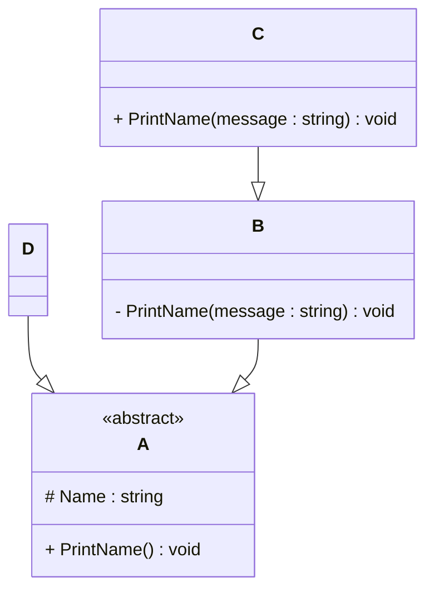

# Programming Test

This test was composed to create a general overview of your knowledge regarding general programming and how it fits with the needs in our lab. Please try to answer all questions using your own knowledge and in your own words. If you get stuck on one of the exercises, still try to give a short answer.

---

## Exercise 1

### Task

Write a program in the language of your choice where:

1. The iteration number (starting from 1), followed by a random number between 1 and 100, is printed 100 times.
2. After every 5 iterations, write an additional separator (e.g., `---`).
3. Write “Lucky number!” after every random number that is divisible by 7.

> Try to keep the procedure as short as possible.
```
// Using C#
using System;
class Program
{
static void Main()
{
Random rand = new Random(); // Random Number Generator
 // Loop of 100 times
        for (int i = 1; i <= 100; i++)
        {
            int randomNumber = rand.Next(1, 101);  // Generate Random Number 1 to 100
            Console.WriteLine($"{i}: {randomNumber}");

 // In every 5 iterations, putting a seperator
            if (i % 5 == 0)
            {
                Console.WriteLine("---");
            }

 // Lucky Number if randomNumber divisible by 7
            if (randomNumber % 7 == 0)
            {
                Console.WriteLine("Lucky number!");
            }
        }
    }
}
```
---

## Exercise 2

### 1. **What is your understanding of the term “Design Patterns”?**

Provide a description in your own words.

```
Design Patterns are like template codes that help developers to reuse similar structures, for solving issues that might have happened before. This way it is faster to get into the solution , understanding the issue and fixing it.
```
### 2. **Explain the MVC Pattern**

- What does MVC stand for?
`Model View Controller` which is a design pattern to organize code. 
- Explain the pattern in detail.
```
While I was working with MVC design pattern using C# and .NET Framework on Visual Studio, it helped me to keep my code clear and easily readable especially while I was working on a Financial Web Application. The Model part handles all the data and rules that you want your application to have. One example is what properties should the column in your database have; like enum or normal varchar field and if you want to set it to mandatory.
The View is where the user interface code will be stored (this folder contains files with ".cshtml" for example Index.cshtml) Here the FE developer uses bootstrap, html/css or javascript.
Controller is the decision making part of the application which handles the user input and contains the logic to simple or even complex calculations.
```
- What are some use cases for this framework?
```
The use cases for this framework are seen mostly to applications that need user interface to interact directly with data such as: 
- Web Applications (Finance or E-Commerce Apps)
- Mobile Applications
- CRM / ERP Systems
```

### 3. **List three other design patterns**

- Provide names and details for three additional design patterns.
- Explain how you have used those patterns in the past and how they have solved your problem
- Use diagrams to explain the design patterns.

---

## Exercise 3

### 1. **Implementation Task**

Based on the class diagram below, provide an implementation in any object-oriented programming language of your choice.


```C#
using System;

abstract class A
{
    protected string Name;

    public A(string name)
    {
        Name = name;
    }

    public abstract void PrintName();
}

abstract class B : A
{
    public B(string name) : base(name) { }

    private void PrintName(string message)
    {
        Console.WriteLine("B says: " + message + " " + Name);
    }
}

class C : B
{
    public C(string name) : base(name) { }

    public override void PrintName()
    {
        Console.WriteLine("C default PrintName(): " + Name);
    }

    public void PrintName(string message)
    {
        Console.WriteLine(message + " " + Name);
    }
}

class D : A
{
    public D(string name) : base(name) { }

    public override void PrintName()
    {
        Console.WriteLine("Name: " + Name);
    }
}

// Testing class implementation (Output)
class Program
{
    static void Main(string[] args)
    {
        D d = new D("Alice");
        d.PrintName(); 

        C c = new C("Bob");
        c.PrintName("Hello,");      
        c.PrintName();              
    }
}


```

### 2. **Key Questions**

- Are you able to directly create a new instance of `ObjectA`? Please explain your answer.
- Given an instance of `ObjectC`, are you able to call the method `PrintMessage` defined in `ObjectB`? Please explain your answer.
- Try to explain as many key features of object-oriented programming as you can find in this example.

---

## Exercise 4

### Maintaining and Expanding Software for Component Validation

This exercise focuses on strategies for working with existing code bases and ensuring the software remains maintainable as new features and requirements are introduced.

### 1. **Working with Existing Code**

- How would you approach understanding and contributing to an existing code base with minimal disruption?
- What practices would you follow to ensure your changes integrate well with the current structure?

### 2. **Ensuring Maintainability**

- What techniques would you use to keep the code base clean, modular, and easy to maintain as new features are added?
- How would you handle code documentation and testing to support long-term maintainability?

### 3. **Balancing Flexibility and Stability**

- How would you design or refactor the software to make it flexible for future changes while ensuring the existing functionality remains stable?
- Which design patterns or principles would you apply to achieve this balance

---
